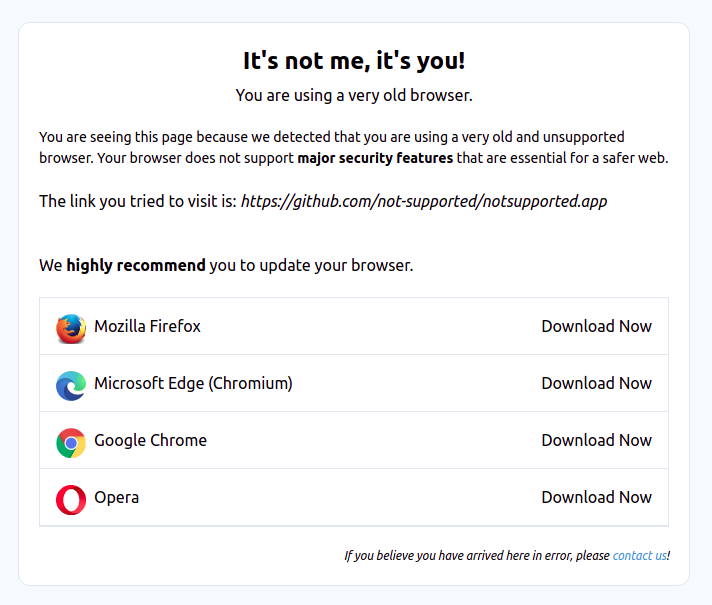

# NotSupported.app
A page to be redirected to when the visitor's browser is not supported.

## How to
Whenever you detect a user with an unsupported browser you have the following options:
1. Show a non-functional website :weary: 
2. Simply redirect to `https://notsupported.app`
3. Redirect to the url with a custom referrer `https://notsupported.app/?referrer=https://github.com`

## Demo
Visit https://notsupported.app **directly** or https://notsupported.app/?referrer=https://github.com

## License
The MIT License (MIT). Please see [License File](LICENSE.md) for more information.
